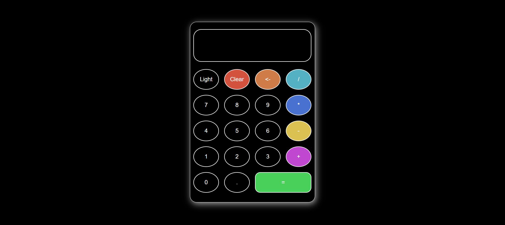
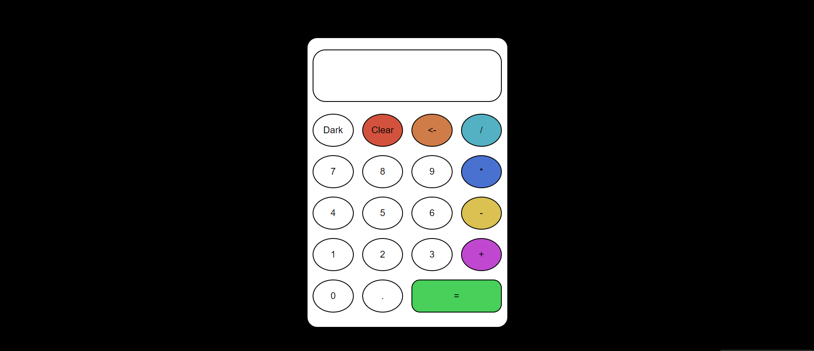

# 🧮 Calculator with Light & Dark Mode

A simple, responsive calculator built using **HTML**, **CSS**, and **JavaScript**, featuring both **light** and **dark** modes for a seamless user experience.

## ✨ Features

- 🌓 **Light/Dark Mode Toggle**: Switch between light and dark themes effortlessly.
- 🎨 **Clean UI**: Simple and intuitive design for easy calculations.
- 📱 **Responsive Design**: Works across various screen sizes.
- 💻 **Basic Calculations**: Supports standard arithmetic operations (addition, subtraction, multiplication, division).

## 📸 Screenshots

## DRAK MODE
 

## LIGHT MODE
 

